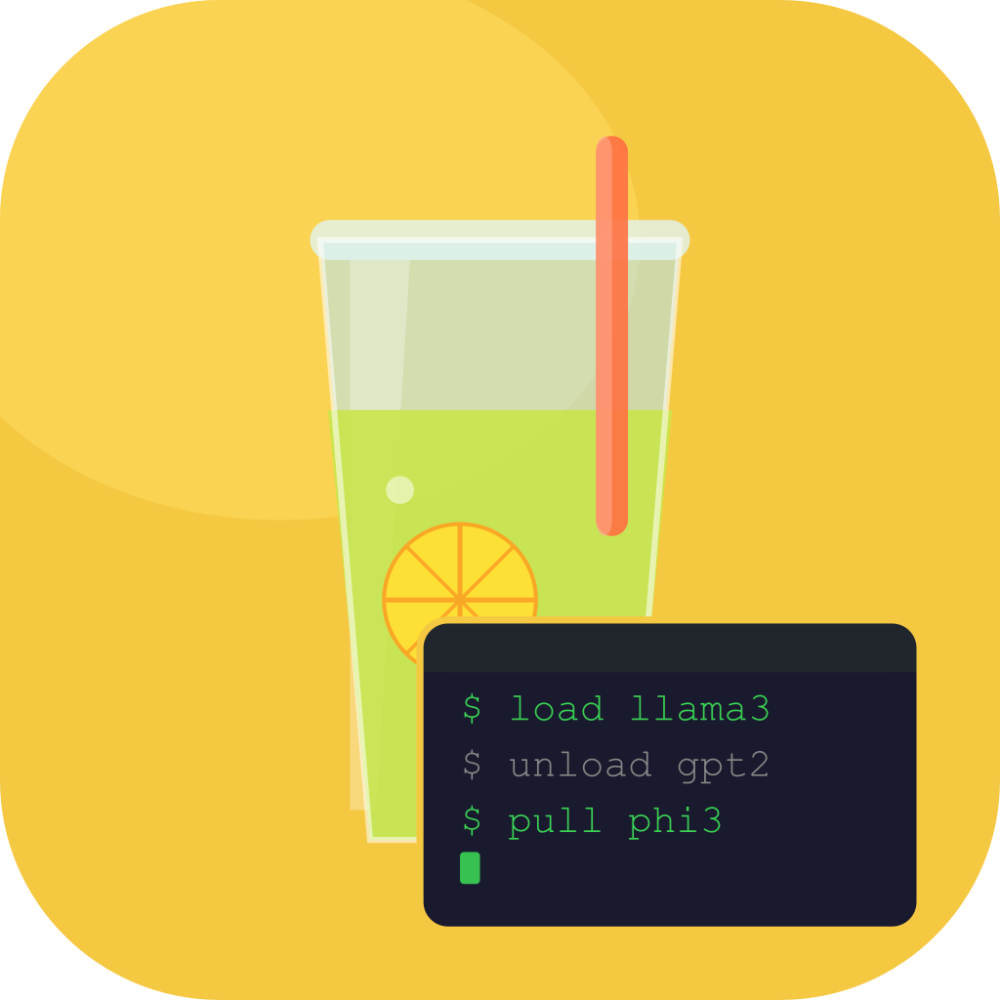
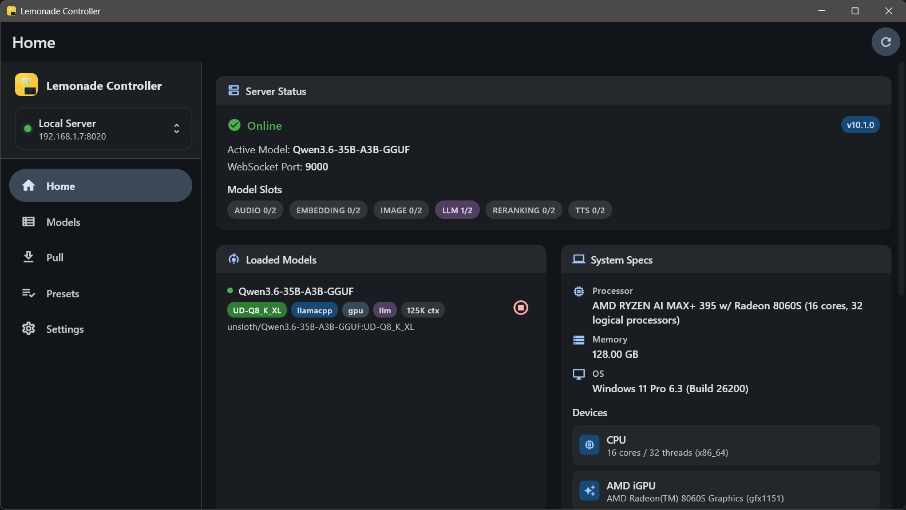
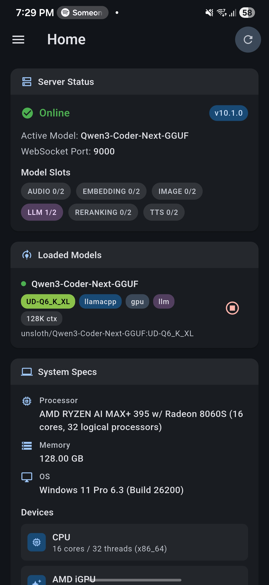
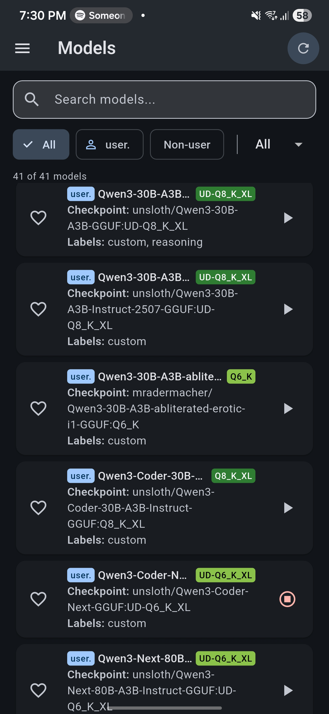
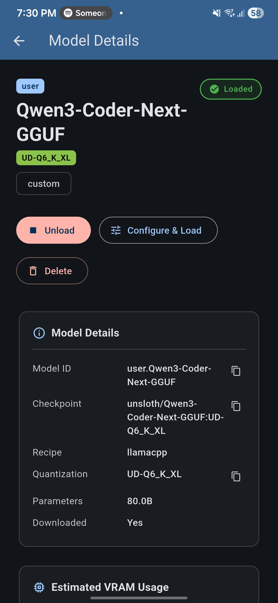
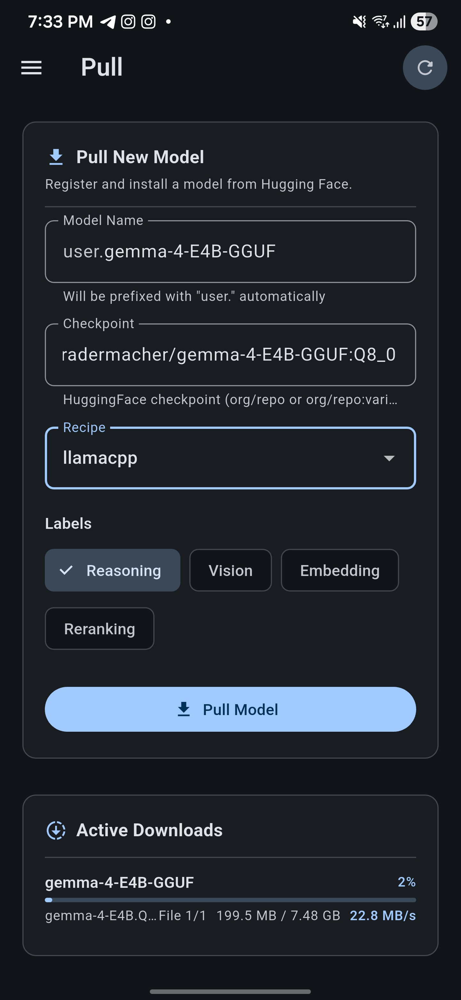
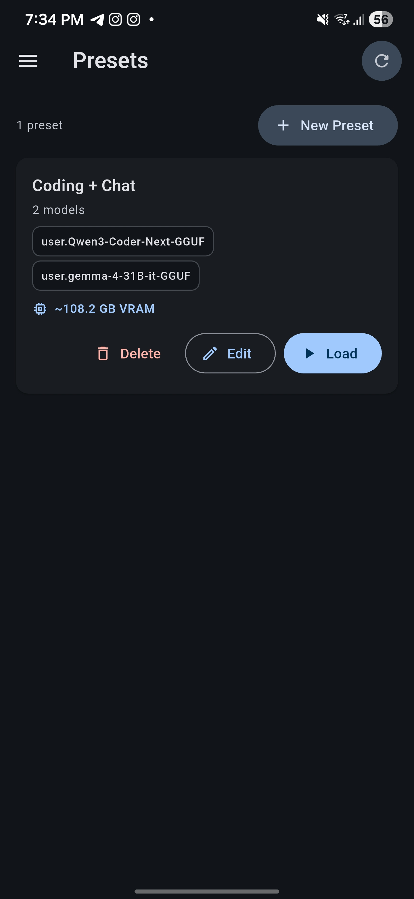

<div align="center">



# Lemonade Controller 🍋

**Manage your Lemonade Server AI models from anywhere — desktop or phone.**

A cross-platform companion app for [Lemonade Server](https://github.com/lemonade-sdk/lemonade).
Load and unload models, pull new checkpoints from Hugging Face, watch live
server health, and organize your favorite model configurations into
reusable presets — all from a clean, responsive UI.

[](#download--install-)
[](#download--install-)
[](#download--install-)
[](#download--install-)
[](https://flutter.dev)
[](https://riverpod.dev)

</div>

---

> **Note:** This is an unofficial, community-built controller for Lemonade Server.

## Features ✨

- **Live Server Dashboard** — See server health, the active model, loaded/loading models, model slot usage, pull/download progress, and your system specs at a glance.
- **Model Catalog** — Browse, search, filter (by `user.` prefix or quantization), and favorite models from your server's catalog.
- **One-Tap Model Actions** — Load, unload, configure-and-load, or delete any model from its dedicated details page.
- **Pull from Hugging Face** — Pull new models by checkpoint/recipe with labels (`reasoning`, `vision`, `embedding`, `reranking`) and watch live download progress (percent, file, bytes, speed) via SSE.
- **Load Presets** — Create, edit, and reorder presets that bundle per-model options (`ctx_size`, `llamacpp_backend`, `llamacpp_args`) so you can batch-load your favorite setups.
- **VRAM Estimation** — See estimated VRAM usage per model and per preset, with editable model parameter overrides through either a form UI or a JSON editor.
- **Multi-Server Profiles** — Save multiple Lemonade Server endpoints and switch between them instantly.
- **Portable Settings** — Export and import all app settings as JSON, or reset everything to defaults in one click.
- **Appearance Controls** — System/light/dark theme and adjustable UI scaling.
- **Responsive Layout** — A unified navigation shell that adapts to mobile, tablet, and desktop.

## Screenshots 📸


<div align="left">
  
  
  
  
  
</div>

## Download & Install 📦

Prebuilt releases are available on the [Releases page](https://github.com/Kidsnd274/lemonade_controller/releases).

Supported platforms:

- **Windows** — Portable `.zip` or Inno Setup installer
- **Android** — APK (split per ABI)
- **macOS** — Apple Silicon, Intel, or Universal bundles
- **Linux** — `.deb` and `.rpm` packages
- **iOS / Web** — Build from source (see below)

## Usage 🚀

1. Make sure you have a running [Lemonade Server](https://github.com/lemonade-sdk/lemonade) instance you can reach over the network.
2. Install and launch Lemonade Controller.
3. Open **Settings → Profiles** and add your server's API base URL (default: `http://localhost:8020/api/v1`).
4. Head to the **Home** tab to see your server's status, or jump into **Models**, **Pull**, or **Presets** to start managing your models.

Your profiles, favorites, presets, refresh preferences, theme/UI scale, and model parameter overrides are all persisted locally on your device.

---

## For Developers 👩‍💻

### Tech Stack 🛠️

- **Framework**: Flutter (Dart)
- **State Management**: Riverpod
- **HTTP Client**: Dio
- **Storage**: SharedPreferences
- **Utilities**: Logger, File Picker, Package Info Plus

### API Integration

The app integrates with [Lemonade Server](https://github.com/lemonade-sdk/lemonade) using a configurable API base URL (default: `http://localhost:8020/api/v1`).

- `GET /system-info` — System/device info and recipe/backend capabilities
- `GET /health` — Server status, active model, loaded models, and capacity
- `GET /models` — Model catalog
- `POST /load` — Load a model (optionally with runtime options)
- `POST /unload` — Unload a model
- `POST /delete` — Delete a model
- `POST /pull` — Pull a model with streaming progress events (SSE)

### Prerequisites

- Flutter SDK `^3.10.8`
- Dart SDK `^3.10.8`
- A running Lemonade Server API endpoint

### Development Setup

```bash
git clone https://github.com/Kidsnd274/lemonade_controller.git
cd lemonade_controller
flutter pub get
flutter run
```

### Supported Platforms

Android · iOS · Windows · macOS · Linux · Web

### Build & Distribution

Preconfigured scripts are available in `scripts/`:

- **Windows**: `scripts/build_windows.bat`
  - Builds Windows release, zips portable output, and creates an Inno Setup installer.
- **Android**: `scripts/build_android.bat`
  - Builds APKs (split per ABI by default) and copies versioned artifacts into `dist/`.
- **macOS**: `scripts/build_macos.sh`
  - Builds and packages Apple Silicon, Intel, and Universal zip bundles.
- **Linux**: `scripts/build_linux.sh`
  - Builds release and packages both DEB and RPM artifacts (via `fastforge` or `flutter_distributor`).

Most scripts infer app version from `pubspec.yaml` and write outputs to `dist/`.

### Project Structure

```text
lib/
├── main.dart                 # App bootstrap + theme/UI scale setup
├── models/                   # Domain models (health, system info, presets, pull events, etc.)
├── pages/
│   ├── home/                 # Dashboard cards and status views
│   ├── models_list/          # Search/filter/favourites model catalog
│   ├── model_page/           # Detailed model actions + VRAM estimate
│   ├── pull/                 # Pull form + live download progress
│   ├── presets/              # Preset list/editor and batch loading
│   ├── settings/             # Profiles, appearance, import/export, overrides
│   └── widgets/              # Shared navigation shell widgets
├── providers/                # Riverpod providers and async state orchestration
├── services/                 # API client + settings persistence
├── theme/                    # App theming
└── utils/                    # Formatters, quant colors, VRAM estimator
```

### Notes

- App settings (profiles, favorites, presets, refresh preferences, theme/UI scale, model param overrides) are persisted locally.
- Download progress and model loading state are reflected both in their dedicated pages and the Home dashboard.
- The project is actively evolving; behavior and APIs may continue to improve between releases.
