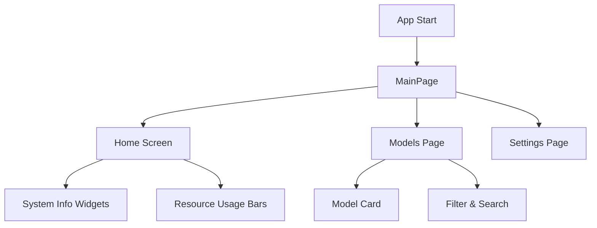

# Lemonade Controller 🍋

A cross-platform desktop/mobile application for managing AI models on a Lemonade Server. Load, unload, and organize models with ease while monitoring system resources in real-time.

## ⚠️ Disclaimer

This project is currently in the early stages of development. Features may be incomplete or subject to change. The app is not yet ready for production use.

## Features ✨

- **Multi-Server Support** - Easily switch between multiple Lemonade Server instances
- **Model Management** - Load/unload models with a single tap
- **Model Presets** - Create and save presets for quick model loading
- **Resource Monitoring** - Visualize VRAM/RAM usage with progress bars
- **Favourites** - Mark models as favourites for quick access
- **Smart Filtering** - Filter models by `user.` prefix
- **Custom Profiles** - Configure load profiles per model
- **Exportable Config** - Save and share your configurations
- **OpenAI Compatible Servers** - Future support for OpenAI-compatible servers (basic functionality only)

## Screenshots 📸

*(Add screenshots here once the app is more developed)*

## Architecture 🏗️

```
lib/
├── main.dart              # App entry point
├── models/                # Data models
│   ├── lemonade_model.dart
│   └── server_config.dart
├── pages/                 # Screen pages
│   ├── home/
│   ├── models/
│   └── settings/
├── providers/             # Riverpod state management
├── services/              # API and data services
└── utils/                 # Helper functions
```

## Tech Stack 🛠️

- **Framework**: Flutter (Dart)
- **State Management**: Riverpod
- **HTTP Client**: Dio
- **Logging**: Logger
- **Storage**: SharedPreferences

## API Integration

The app integrates with the [Lemonade Server](https://github.com/lemonade-sdk/lemonade) API endpoints:

- `GET /system-info` - System resource information
- `GET /health` - Server health and loaded models
- `GET /models` - Available models list
- `POST /models/load` - Load a model
- `POST /models/unload` - Unload a model

## Getting Started 🚀

### Prerequisites

- Flutter SDK ^3.10.8
- Dart SDK ^3.10.8
- A running Lemonade Server instance

### Development Setup

```bash
# Clone the repository
git clone https://github.com/Kidsnd274/lemonade_controller.git

# Navigate to the project directory
cd lemonade_controller

# Install dependencies
flutter pub get

# Run the app
flutter run
```

### Supported Platforms

- Android
- iOS
- Windows
- macOS
- Linux
- Web

## Project Structure

### Models

- [`LemonadeModel`](lib/models/lemonade_model.dart) - Represents an AI model with properties like ID, checkpoint, quantization, and recipe
- `ServerConfig` - Stores server connection details
- `SystemInfo` - Contains system resource information
- `HealthStatus` - Tracks loaded models and server status

### Services

- [`LemonadeApiClient`](lib/services/api_client.dart) - Handles all API communication with the Lemonade Server

### State Management

- Riverpod providers for async data fetching and state management

## Development

### Code Structure



### Key Features Implementation

1. **Model Card Display**
   - Model name (without `user.` prefix)
   - Quantization level from checkpoint
   - Model size estimation
   - Recipe type (llamacpp, whispercpp, etc.)
   - Labels (custom, reasoning, etc.)

2. **Resource Monitoring**
   - VRAM usage bar
   - RAM usage bar
   - Loaded model count vs max capacity
   - Active backend technology (Vulkan, ROCm, etc.)

3. **Preset System**
   - Create named presets
   - Select multiple models to load
   - Estimate VRAM requirements
   - Validate against server capacity
