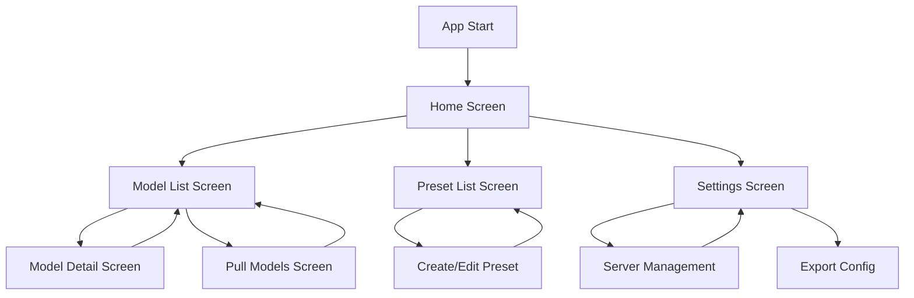

# Lemonade Controller - Technical Design Document

## Overview

Lemonade Controller is a cross-platform mobile application for managing AI models on a Lemonade Server. The app provides features for loading/unloading models, creating presets, and monitoring system resources.

## Project Structure

```
lib/
├── main.dart                    # App entry point
├── models/                      # Data models
│   ├── server_config.dart       # Server connection configuration
│   ├── lemonade_model.dart      # Model definition
│   ├── system_info.dart         # System resource information
│   ├── health_status.dart       # Server health/loaded models
│   └── preset.dart              # Load preset configuration
├── services/                    # API and data services
│   ├── api_client.dart          # HTTP client for Lemonade Server API
│   └── storage_service.dart     # Local storage for presets/config
├── widgets/                     # Reusable widgets
│   ├── model_card.dart          # Display model information
│   ├── resource_bar.dart        # Resource usage visualization
│   ├── server_selector.dart     # Server switching widget
│   └── ...
├── screens/                     # Screen pages
│   ├── home/
│   │   ├── home_screen.dart
│   │   └── widgets/
│   ├── models/
│   │   ├── model_list_screen.dart
│   │   └── model_detail_screen.dart
│   ├── presets/
│   │   └── preset_list_screen.dart
│   └── settings/
│       └── settings_screen.dart
├── states/                      # State management
│   ├── app_state.dart           # Global state (if needed)
│   └── ...
├── utils/                       # Helper functions
│   ├── formatter.dart           # Utility for formatting sizes, numbers
│   └── validators.dart          # Input validation
└── constants/                   # Constants
    ├── api_endpoints.dart
    ├── app_colors.dart
    └── app_strings.dart
```

## Core Data Models

### 1. ServerConfig
```dart
class ServerConfig {
  final String id;                    // Unique identifier
  final String name;                  // User-friendly name
  final String baseUrl;               // Server base URL (e.g., http://127.0.0.1:8001)
  final String? apiKey;               // Optional API key
  final bool isDefault;               // Default server flag
  final DateTime lastConnected;       // Last connection timestamp
}
```

### 2. LemonadeModel
```dart
class LemonadeModel {
  final String id;                    // Model ID (e.g., "user.gemma-3-27b-it-abliterated-GGUF")
  final String checkpoint;            // Checkpoint reference
  final bool downloaded;              // Download status
  final List<String> labels;          // Model labels (custom, reasoning, etc.)
  final String recipe;                // Recipe name (llamacpp, whispercpp, etc.)
  final Map<String, dynamic> recipeOptions; // Recipe-specific options
  final bool suggested;               // Suggested by server
  final String ownedBy;               // Owner (always "lemonade")
  
  // Derived properties
  String get displayName => id.replaceFirst('user.', '');
  String get quantization => checkpoint.split(":").last;
  bool get isUserModel => id.startsWith('user.');
  int? getEstimatedVramGb() =>估算VRAM usage;
}
```

### 3. SystemInfo
```dart
class SystemInfo {
  final String biosVersion;
  final String cpuMaxClock;
  final String oemSystem;
  final String osVersion;
  final String physicalMemory;
  final String processor;
  final String windowsPowerSetting;
  
  final DeviceInfo cpu;
  final DeviceInfo amdIgpu;
  final DeviceInfo amdDgpu;
  final DeviceInfo nvidiaDgpu;
  final DeviceInfo npu;
  
  final Map<String, RecipeInfo> recipes;
}

class DeviceInfo {
  final String name;
  final bool available;
  final String? error;
  final int? cores;
  final int? threads;
  final double? vramGb;
  final double? virtualMemGb;
  final List<String> devices;
}

class RecipeInfo {
  final String recipe;
  final Map<String, BackendInfo> backends;
}

class BackendInfo {
  final String name;
  final bool available;
  final bool supported;
  final List<String> devices;
  final String? error;
  final String? version;
}
```

### 4. HealthStatus
```dart
class HealthStatus {
  final String status;
  final String version;
  final bool logStreamingSse;
  final bool logStreamingWebsocket;
  final Map<String, int> maxModels;  // audio, embedding, image, llm, reranking
  final String modelLoaded;          // Currently loaded model ID
  final List<LoadedModel> allModelsLoaded;
}

class LoadedModel {
  final String modelId;
  final String model_name;
  final String checkpoint;
  final String recipe;
  final Map<String, dynamic> recipeOptions;
  final String device;               // cpu, gpu, npu
  final String backendUrl;
  final int lastUse;
  final String type;                 // llm, image, audio, embedding
}
```

### 5. Preset
```dart
class Preset {
  final String id;
  final String name;
  final String description;
  final List<String> modelsToLoad;   // List of model IDs
  final Map<String, dynamic> createdAt;
  final Map<String, dynamic> updatedAt;
  
  // Derived
  int getEstimatedVramUsage() =>估算总VRAM;
  bool isValidForServer(SystemInfo system) =>检查服务器资源;
}
```

## Navigation Flow



## State Management Approach

For this project, I recommend using **Provider** or **Riverpod** for state management:

### Provider (Simpler, recommended for beginners)
- Easy to learn and implement
- Good documentation and community support
- Sufficient for this project's complexity

### Riverpod (More powerful)
- Better testability
- More flexible
- Slightly steeper learning curve

## API Service Design

```dart
class LemonadeApiClient {
  final String baseUrl;
  final String? apiKey;
  
  // Constructor
  LemonadeApiClient(this.baseUrl, [this.apiKey]);
  
  // Health endpoint
  Future<HealthStatus> getHealth() async;
  
  // System info endpoint
  Future<SystemInfo> getSystemInfo() async;
  
  // Models list endpoint
  Future<List<LemonadeModel>> getModelsList() async;
  
  // Load model endpoint
  Future<void> loadModel(String modelId) async;
  
  // Unload model endpoint
  Future<void> unloadModel(String modelId) async;
  
  // Get presets
  Future<List<Preset>> getPresetList() async;
  
  // Create/update preset
  Future<void> savePreset(Preset preset) async;
  
  // Delete preset
  Future<void> deletePreset(String presetId) async;
}
```

## UI Components

### Model Card Widget
```
┌─────────────────────────────────────┐
│ Model Name (user.gemma-3-27b...)   │
│ ─────────────────────────────────── │
│ 📦 GGUF: Q4_K_L    📊 27.0 GB      │
│ 🎯 llamacpp    🏷️ custom reasoning │
│                                     │
│ [Unload] [❤️ Favorite] [⋮ Menu]    │
└─────────────────────────────────────┘
```

### Home Screen Widgets
```
┌──────────────────────────────────────┐
│ Server: [localhost:8001 ▼]           │
├──────────────────────────────────────┤
│ 📊 Resource Usage                    │
│ ┌────────────────────────────────┐   │
│ │ VRAM: ████████████░░░░░░░░  8/16│   │
│ │ RAM:  █████████████░░░░░  16/32 │   │
│ └────────────────────────────────┘   │
├──────────────────────────────────────┤
│ 📦 Loaded Models: 1/4 (LLM)          │
│    - gemma-3-27b-it-abliterated     │
├──────────────────────────────────────┤
│ 🖥️ System Specs                      │
│ • AMD RYZEN AI MAX+ 395 (16 cores)  │
│ • AMD Radeon 8060S Graphics          │
│ • 128 GB RAM                         │
│ • Vulkan Backend Active              │
└──────────────────────────────────────┘
```

### Preset Card Widget
```
┌─────────────────────────────────────┐
│ Preset Name                         │
│ Description of what this preset does│
│                                     │
│ 📦 3 models to load                 │
│ 🎯 Est. VRAM: 32 GB                 │
│ ⚠️  Server Cap: 4 LLMs              │
│                                     │
│ [Load Preset] [Edit] [🗑️ Delete]   │
└─────────────────────────────────────┘
```

## Filtering & Sorting

### Filter Logic
1. **Prefix Filter**: Show only models with `user.` prefix
2. **Favourite Filter**: Show favourited models first
3. **Search Filter**: Search by model name, labels

### Sort Options
- A-Z (alphabetical)
- Z-A (reverse alphabetical)
- VRAM Usage (high-low)
- VRAM Usage (low-high)
- Most Recently Used

## Storage Strategy

### Local Storage (Hive or Shared Preferences)
- Saved server configurations
- User preferences (theme, default server)
- Favourite models list
- Preset configurations

### Cloud Backup (Optional - Future)
- Export to JSON
- Import from JSON
- Sync across devices

## Testing Strategy

1. **Unit Tests**: Test models, services, utilities
2. **Widget Tests**: Test individual widgets
3. **Integration Tests**: Test API calls and navigation flow

## Future Enhancements

1. **Real-time Updates**: WebSocket for live system monitoring
2. **Multi-user Support**: Server-side user management
3. **Batch Operations**: Load/unload multiple models simultaneously
4. **Model Comparison**: Compare model specifications
5. **Export Logs**: Export server logs for debugging

## Notes for Flutter Beginners

### Key Concepts to Learn
1. **State Management**: Provider/Riverpod for managing UI state
2. **Async Programming**: Future, async/await for API calls
3. **Navigation**: Navigator 2.0 for screen transitions
4. **HTTP Client**: Dio for making API requests
5. **StatefulWidget vs StatelessWidget**: Know when to use each

### Tips
- Start with simple screens and add complexity gradually
- Use hot reload frequently to see changes
- Follow Flutter's material design guidelines
- Test on both Android and iOS (or simulators)